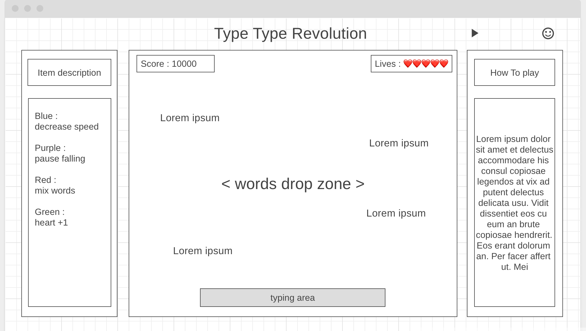

## TTR

### Background and Overview

#### **Background**
As a forienger whose first language is not an English, typing quickly and accurately is always my primary concern in order to enhance my code writing speed.  

#### **Overview**
TTR (Type Type Revolution) is a typing game using JavaScript and Canvas API.  
Words will fall from the top and the user has to corretly type each word before they hit the bottom of the screen.  
Word falling speed will increse depending on the level. Some words have special abilities such as decreasing speed, stopping time, or reassembling words.

### Functionality and MVPs 

in TTR users will be able to:
- [ ]  type words that are falling from the top
- [ ]  remove words that are typed correctly and in time.
- [ ]  play / pause / exit game
- [ ]  save their score when game is over

In addition, this project will include:
- [ ] a 'how to play' description
- [ ] public profile of creator
- [ ] dashboard of previous high scores 

### Wireframes 

### Architecture and Technology 

game : Javascript 
display : Canvas 
styling : HTML & SCSS

### Implementation Timeline 

* Create overall skeleton, layout frames (1 day)
* Game logic (~ 2days)
* Styling (1 day)

### Bonus

